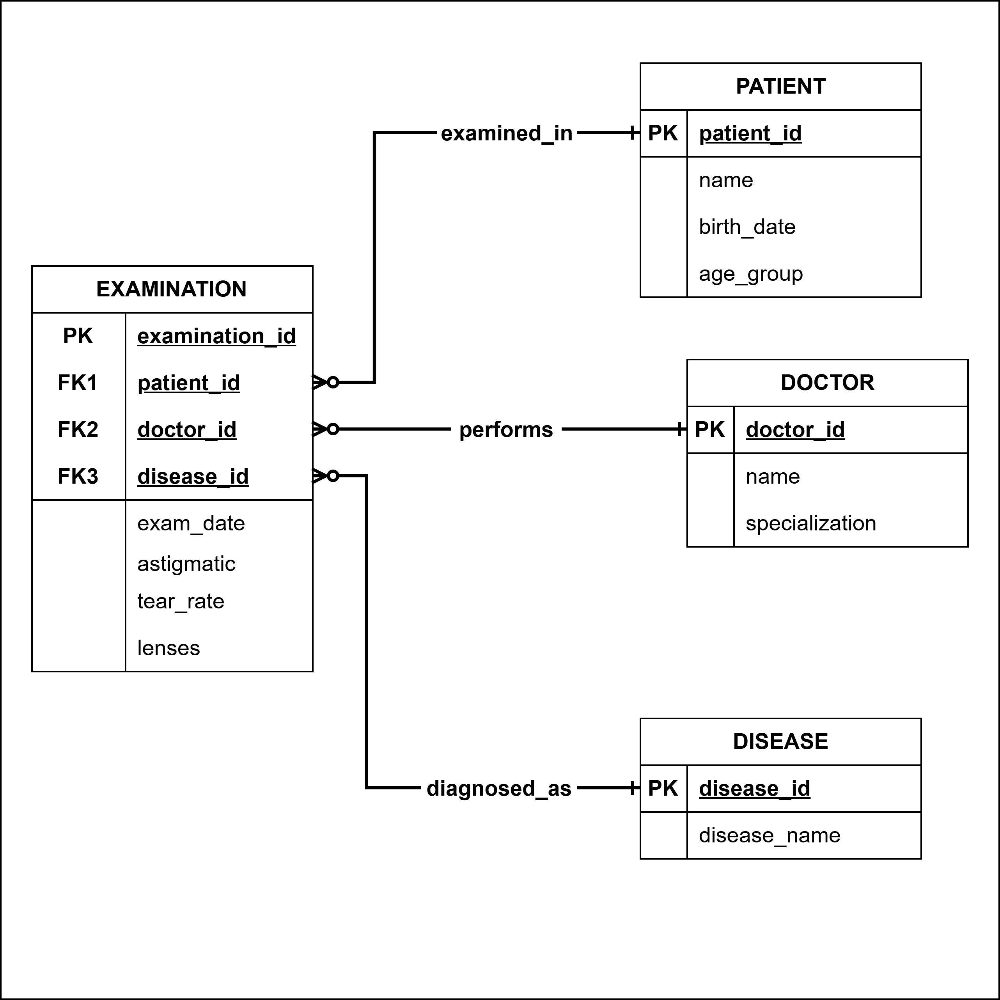
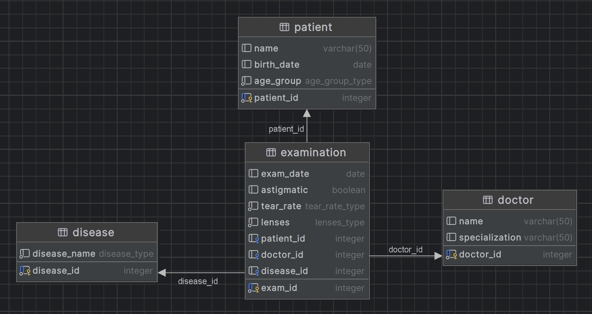

# Machine Learning and Data Mining - FINAL PROJECT A

**Date:** *29.10.2025*  
**Working Group:** *D16*  
**Authors:**  
| Name              | Student Number    |
|-------------------|-------------------|
| Wojciech Sekula   | A54219            |
| Keira Barazzoli   | A54213            |
| Jakub Wilk        | A53995            |
| Sipos Máté        | A54216            |

---

## 1. Introduction

### 1.1 Problem Context
The company MedKnow is a medical center that collects data about patients during ophthalmological examinations. Each patient is examined by a doctor and may present conditions such as myopia, hypermetropia, or astigmatism. The goal of the system is to provide **support for lens prescription** by learning from historical data and identifying patterns that indicate the most appropriate lens type (soft, hard, or none).

### 1.2 Data Understanding
The dataset includes the following descriptive features:
- **Age group:** {young, pre-presbyopic, presbyopic}  
- **Disease name:** {myope, hypermetrope, astigmatic}  
- **Astigmatism:** {yes, no}  
- **Tear production:** {normal, reduced}  
The **target attribute** is: **lenses** ∈ {soft, hard, none}

This dataset is small and categorical, which makes it suitable for **rule-based and tree-based classifiers**.

## 2. Conceptual and Logical Data Model

### 2.1 Conceptual Model (ER Diagram)

<p align="center">
    
</p>

The system considers the following main entities:
- **PATIENT**
- **DOCTOR**
- **DISEASE**
- **EXAMINATION** (link between Patient and Doctor, storing condition and prescribed lens)

### 2.2 Logical Schema and Implementation
The database is implemented in PostgreSQL and includes primary keys, foreign keys, and controlled vocabulary constraints.  

```sql
CREATE TYPE tear_rate_type AS ENUM ('normal', 'reduced');
CREATE TYPE lenses_type AS ENUM ('hard', 'soft', 'none');
CREATE TYPE age_group_type AS ENUM ('young', 'pre-presbyopic', 'presbyopic');
CREATE TYPE disease_type AS ENUM ('myope', 'hypermetrope', 'astigmatic');

REATE TABLE PATIENT (
    patient_id SERIAL PRIMARY KEY,
    name VARCHAR(50),
    birth_date DATE,
    age_group age_group_type NOT NULL
);

CREATE TABLE DOCTOR (
    doctor_id SERIAL PRIMARY KEY,
    name VARCHAR(50),
    specialization VARCHAR(50)
);

CREATE TABLE DISEASE (
    disease_id SERIAL PRIMARY KEY,
    disease_name disease_type NOT NULL
);

CREATE TABLE EXAMINATION (
    exam_id SERIAL PRIMARY KEY,
    exam_date DATE,
    astigmatic BOOLEAN,
    tear_rate tear_rate_type NOT NULL,
    lenses lenses_type NOT NULL,
    patient_id INT REFERENCES PATIENT(patient_id),
    doctor_id INT REFERENCES DOCTOR(doctor_id),
    disease_id INT REFERENCES DISEASE(disease_id)
);
```
<p align="center">
    
</p>

---

## 3. Project

### 3.1 Project Structure

```bash
[].
├── [] data         # Input data for models and Orange Datamining.
├── [] docs         # Project documentation.
├── [] graphics     # Images with diagrams.
├── [] orange       # .ows files for Orange Datamining.
├── [] scripts      # Python source code of models, dataset export scripts,
                    # data models and demo main() execution.
├── [] sql          # SQL scripts for creating tables and views.
├── [] webapp       # Source code for Web application interface.
└── X README.md     # file with deploment instructions.
```

### 3.2 Specific files description

**src:**

- `dataset.py` - contains 3 functions for creating synthetic lenses data, exporting data to *.tsv * file for Orange datamining software and exporting to *.tsv* file for 1R, ID3 and Naive Bayes models. When generating data function follows these rules so that the output is realistic:
```python
    if tear == TearRate.REDUCED:
        return LensType.NONE
    if disease == Disease.MYOPE and astig:
        return LensType.HARD
    if disease == Disease.HYPERMETROPE and tear == TearRate.NORMAL:
        return LensType.SOFT
    return LensType.SOFT
```
- `models.py` - contains dataclass definition for Database config variable and Enums for database values.
- `r1_model.py`, `src/id3_model.py`, `src/naive_bayes_model.py` - implementations of machine learning models
- `main.py` - contains execution of creating and exporting data for models and Orange software usage, it also runs every model against the dataset and prints their metrics (accuracy, error rate etc.)

**sql:**
- `create_tables.sql` - query for creating tables and enums in database
- `export_models.sql` - query for exporting EXAMINATIONS data to *.tsv* file 
- `export_orange.sql` - query for exporting EXAMINATIONS data to *.tsv* file in *Orange Datamining* format

**others:**
- `webapp/` - contains web aplication with very simple html template for testing models. It runs on FastAPI and can return prediction for given set of input attributes.
- `README.md` - instructions for runing main script and deploying *webapp*

### 3.3 Classification Methods Implemented

#### 3.3.1 One Rule (1R)

`OneR (One Rule)` is a very simple classification algorithm that builds just one rule based on the dataset.
For each attribute, the algorithm checks which class appears most frequently for every value of that attribute, and creates a rule assigning that class. Then it calculates the number of classification errors for that attribute. After evaluating all attributes, `OneR` chooses the attribute with the lowest error rate and uses it as the final rule.  
Even though OneR is extremely simple, it often achieves surprisingly good accuracy, while keeping the resulting model easy to understand and explain, which makes it useful for decision support systems.  

**Algorithm**:
```
For each predictor
    For each value of that predictor, make a rule as follows
        1. Count how often each value of target (class) appears
        2. Find the most frequent class
        3. Make the rule assign that class to this value of the predictor
    Calculate the total error / accuracy of the rules of each predictor
Choose the predictor with the smallest total error or highest accuracy.
```

#### 3.3.2 ID3 Decision Tree

ID3 stands for Iterative Dichotomiser 3 and is named such because the algorithm repeatedly divides features into two or more groups at each step creating a decision tree. A decision tree is a classification model that makes predictions by recursively splitting the data into branches based on attribute values, forming a tree-like structure of decisions and outcomes. ID3 uses a top-down greedy approach to build a decision tree that means we start from the root and select the best feature at the present moment of execution.

ID3 uses Information Gain or just Gain to find the best feature. Information Gain calculates the reduction in the entropy and measures how well a given feature separates or classifies the target classes. Entropy is the measure of disorder and the Entropy of a dataset is the measure of disorder in the target feature of the dataset.  
```Entropy(S) = - ∑ pᵢ * log₂(pᵢ) ; i = 1 to n```
where:  
- `n` is the total number of classes in the target column,
- `pᵢ` is the fraction of records that belong to class `i`. We calculate it by dividing the number of rows with class `i` by the total number of rows in the dataset. `pᵢ` tells us how common each class is in the data.

Information gain is calculated as:
```IG(S, A) = Entropy(S) - ∑((|Sᵥ| / |S|) * Entropy(Sᵥ))```
where:  
- `Sᵥ` is the set of rows in `S` for which the feature column `A` has value `v`, 
- `|Sᵥ|` is the number of rows in `Sᵥ`,
- `|S|` is the number of rows in `S`

**Steps to build decision tree:**  
1. Calculate the Information Gain for each feature in the dataset.
2. Select the feature with the highest Information Gain, because it separates the classes best.
3. Create a decision tree node using this feature and split the dataset into subsets based on its values.
4. If a subset contains only one class, make it a leaf node labeled with that class.
5. Repeat the process for each subset using the remaining features, until:
    - there are no more features to split on, or
    - all nodes become leaf nodes.

To make a prediction with a decision tree, we start at the root node and follow the branches based on the values of the input features. At each internal node, we check the feature used for the split and choose the branch that matches the input. We continue moving down the tree until we reach a leaf node, whose label is the final predicted class.

#### 3.3.3 Naive Bayes Classifier

Naive Bayes is a simple probabilistic classifier based on Bayes’ theorem with a naive independence assumption between features. In plain words: for a new case we check how well its feature values “fit” each class, multiply those fits together (we actually add logs), and pick the class with the highest score.

**Idea**:  
- Compute how common each class is in the data (class prior).  
- For each feature value, compute how often it appears inside each class (conditional probability).  
- At prediction time, combine the prior and all conditionals for a class; choose the largest.  

In our project (all features are categorical):  
- Features: `age_group`, `disease_name`, `astigmatic`, `tear_rate`.  
- We estimate probabilities from counts.  
- Use Laplace smoothing (add 1 to counts) so we never get zero probability.  
- If a value didn’t appear in training, use a small fallback probability.  

Training:
1. Prior: `P(class) = count(class) / total_rows.`
2. Conditional: for each feature `A` and value `v` inside class `C`
    `P(A=v | C) = (count(A=v and C) + 1) / (count(C) + |V_A|)`
    where `|V_A|` is the number of distinct values of `A`.

Prediction:
1. For each class `C`, compute the log-score: `score(C) = log P(C) + Σ log P(value_j | C)`
2. Return the class with the highest score.

This model is fast, easy to implement, and robust on small datasets. It works naturally with categorical data and gives transparent, explainable results. But it has its limitations for example it assumes features are independent given the class (often not fully true). Also if there are strong interactions between features, tree-based models can perform better.  

---

## 4. Conclusions

### 4.1 Main run example

```
===============================
 Model: One Rule (1R)
===============================
Selected attribute: tear_rate
Rules:
  IF tear_rate = normal → lenses = soft
  IF tear_rate = reduced → lenses = none
Default class: none

Accuracy:
  Train: 95.83%
  Test:  93.33%


===============================
 Model: ID3 Decision Tree
===============================
Tree structure:
[tear_rate == reduced]
  -> none
[tear_rate == normal]
  [disease_name == myope]
    [astigmatic == yes]
      -> hard
    [astigmatic == no]
      -> soft
  [disease_name == astigmatic]
    -> soft
  [disease_name == hypermetrope]
    -> soft

Accuracy:
  Train: 100.00%
  Test:  100.00%


===============================
 Model: Naive Bayes
===============================
Accuracy:
  Train: 95.83%
  Test:  93.33%


===============================
 5-Fold Cross Validation Summary
===============================
Model          Mean Acc    Std Dev   Folds
1R                0.953      0.007   0.967, 0.950, 0.950, 0.950, 0.950
ID3               1.000      0.000   1.000, 1.000, 1.000, 1.000, 1.000
NaiveBayes        0.953      0.007   0.967, 0.950, 0.950, 0.950, 0.950
```

### 4.2 Model Evaluation and Comparison
The results show clear differences between the three classifiers that were tested: One Rule (1R), ID3 Decision Tree, and Naive Bayes.  

The ID3 Decision Tree performed the best. It reached 100% accuracy on both the training and test sets, and also in the 5-fold cross-validation. This means that the patterns in the dataset are quite clear and the decision tree was able to learn them perfectly. The structure of the tree also matches the rules used to generate the data, which makes it easy to understand why the model made a given prediction.  

The One Rule (1R) classifier created a very simple decision rule based on just one attribute (tear_rate). Even though it uses only one feature, it still achieved around 93–96% accuracy, which is surprisingly good. This shows that tear_rate is a very important indicator in determining the lens type.  

The Naive Bayes model reached similar accuracy to 1R. However, because it assumes that all features are independent (which is not entirely true), it did not outperform the decision tree. Still, it is a stable and reliable method.  

### 4.3 Summary

To summarize:
- ID3 is the most accurate model and also easy to interpret.  
- 1R is very simple and still provides good results.  
- Naive Bayes performs well, but not better than ID3.  

In practical use, if we want the most accurate predictions and a clear explanation of decisions, ID3 is the best choice. If we prefer a very simple model that is easy to explain, 1R is a good option.  
